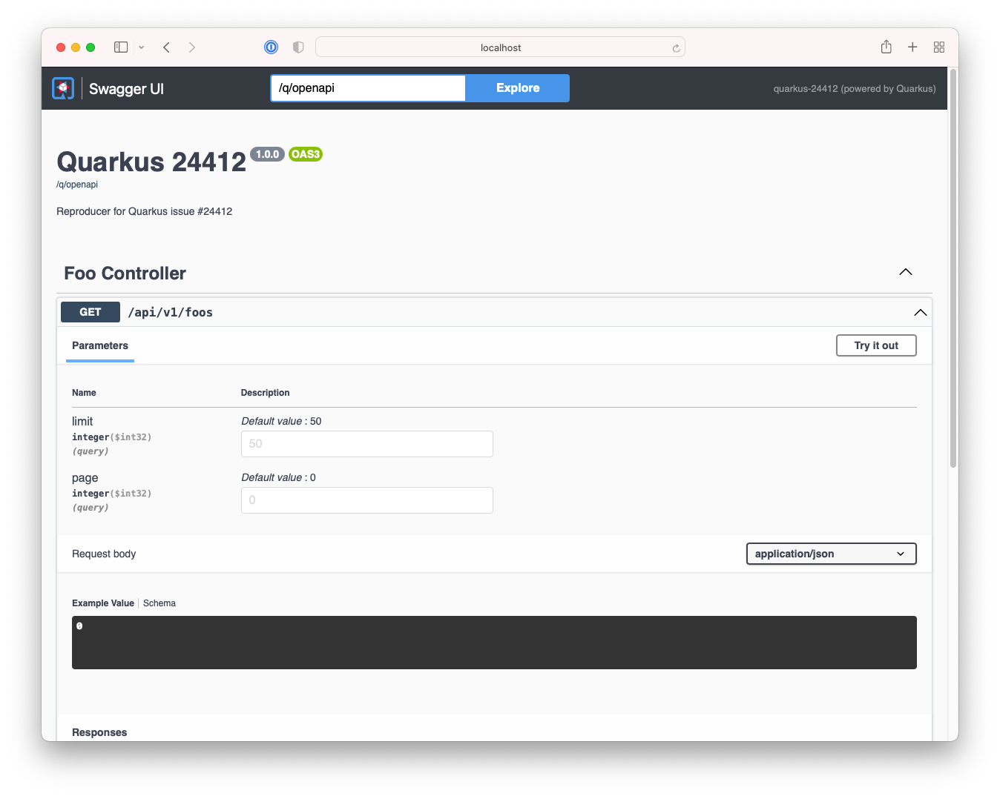

# Quarkus 24412

Requires JDK 17.

Reproducer for Quarkus issue [#24412](https://github.com/quarkusio/quarkus/issues/24412):

1. Start the application with `./gradlew quarkusDev`
2. View the Open API documentation at <http://localhost:10000/q/swagger-ui/>
3. Inspect dependencies with

```
./gradlew -q dependencies --configuration runtimeClasspath | grep smallrye-open-api
```


